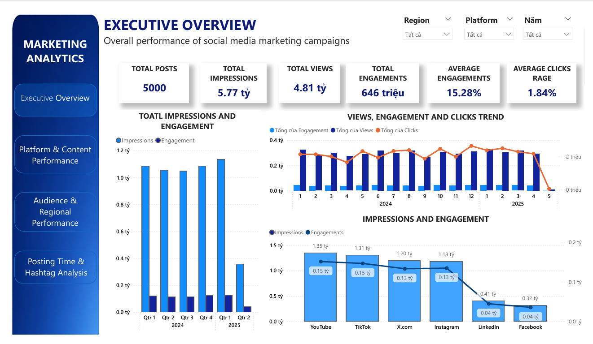
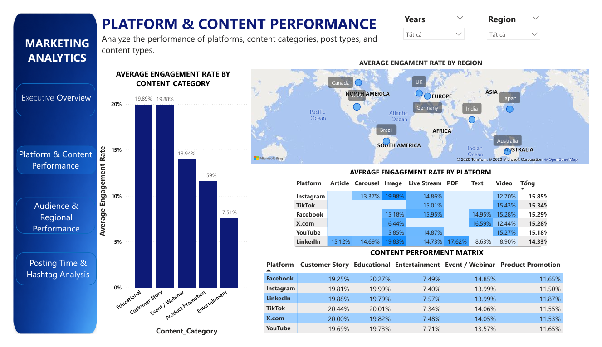
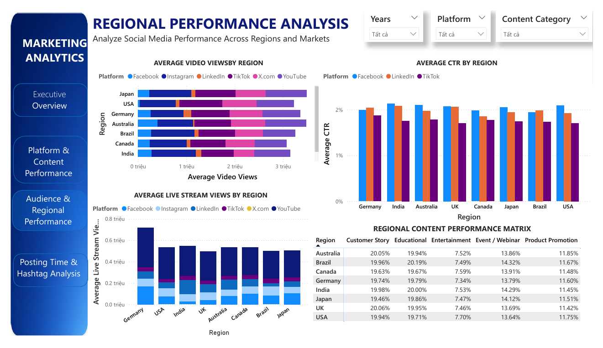

# Power-BI-Dashboard-for-Social-Media-Marketing-Analytics
Interactive Power BI dashboard analyzing social media marketing performance across platforms, content types, regions, and posting strategies.
# Why This Project?
Every day, businesses publish hundreds of posts across different social media platforms. However, creating more content does not necessarily lead to better marketing performance.
The real challenge is understanding what truly drives content performance.
Is it the platform?
The content category?
The posting time?
Or does audience behavior vary across different geographic markets?
Instead of starting with the question "What charts should I build?", this project begins with a more important question:
  # What decisions does a business need to make from its marketing data?
To answer that question, I developed an interactive Power BI dashboard that transforms raw social media data into meaningful business insights, helping marketing teams evaluate campaign performance and optimize future marketing strategies.
# Business Problem
Businesses invest considerable time and budget in producing content across multiple social media platforms, including Facebook, Instagram, TikTok, LinkedIn, YouTube, and X.com. However, measuring the effectiveness of these marketing activities remains a challenge.
This dashboard is designed to answer several business questions:
- Which platform generates the strongest marketing performance?
- Which content category receives the highest audience engagement?
- Which post type performs best on each platform?
- How does marketing performance differ across geographic regions?
- What is the best time to publish content?
- Which hashtags contribute most to campaign performance?
- Where should businesses prioritize their marketing investment?
Rather than simply displaying KPIs, the dashboard focuses on providing insights that support better business decisions.
# Dataset
The analysis is based on a dataset containing **5,000 social media posts** collected across multiple platforms during **2024–2025**.
**Marketing Metrics:** Reach (Impressions, Views, Video Views, Live Stream Views); Engagement (Engagement, Engagement Rate, Likes, Comments, Shares); Conversion (Clicks, Click-Through Rate (CTR)).
**Content Attributes:** Platform; Region; Content Category; Post Type; Main Hashtag; Post Date; Post Hour.
**Coverage:** 6 social media platforms; 8 geographic markets.
# Dashboard Pages
# 1. Executive Overview
Executive Overview provides a high-level summary of overall social media marketing performance by presenting key KPIs, including 5,000 posts, 5.77B impressions, 4.81B views, 646M engagements, a 15.28% average engagement rate, and a 1.84% average CTR. Overall performance remains relatively stable throughout the analysis period, indicating consistent campaign effectiveness over time. Among all platforms, YouTube and TikTok generate the highest levels of impressions and engagement, while Facebook and LinkedIn contribute comparatively lower performance. Although engagement remains strong, the relatively low CTR suggests that converting audience attention into user actions is still a challenge. These findings provide an overall understanding of campaign performance and establish the foundation for deeper analysis of platform effectiveness, content performance, regional behavior, and posting strategy in the following dashboard pages.

# 2. Platform & Content Performance
This page analyzes how content categories, platforms, and post formats influence marketing performance. Educational and Customer Story content consistently deliver the highest engagement rates (around 20%), indicating that audiences respond more positively to informative and experience-based content than promotional posts. While engagement remains relatively consistent across regions, platform performance varies depending on content format. Instagram achieves the highest overall engagement rate (15.85%), followed closely by TikTok and Facebook, suggesting these platforms are more effective for driving audience interaction. These findings indicate that businesses should prioritize high-performing content categories while tailoring content formats to the strengths of each platform instead of adopting a one-size-fits-all strategy.

# 3. Audience & Regional Performance
This page analyzes marketing performance across different geographic markets by combining regional reach, conversion, and content engagement metrics. Germany achieves the highest average video views and live stream views, indicating stronger audience reach than other regions, while CTR remains relatively consistent across markets at around 2%, suggesting that higher exposure does not always result in higher conversion. The Regional Content Performance Matrix further shows that Educational and Customer Story consistently deliver the highest engagement rates across all countries, whereas Entertainment and Product Promotion generate lower engagement. Overall, the results indicate that although audience size varies by region, user content preferences remain highly consistent, allowing businesses to prioritize investment in high-performing markets such as Germany, Australia, and the United States while maintaining a similar content strategy across different regions.

# 4. Posting Strategy

# Key Insights
The dashboard reveals several important patterns:
Marketing performance varies significantly across social media platforms.
Different content categories produce different levels of audience engagement.
Regional differences indicate that audience behavior is not consistent across markets.
Posting time has a measurable impact on engagement performance.
Effective hashtag selection contributes to better content visibility and interaction.
# Business Recommendations
Based on the analysis, businesses should consider:
Developing platform-specific marketing strategies.
Investing more in high-performing content categories.
Localizing campaigns for different geographic markets.
Publishing content during peak engagement periods.
Continuously monitoring hashtag performance.
Evaluating campaigns using multiple KPIs rather than a single performance metric.
